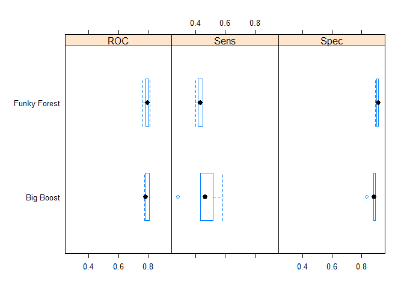

<!-- README.md is generated from README.Rmd. Please edit that file -->
modelgrid 
============================================================

[](https://travis-ci.org/smaakage85/modelgrid) [](https://ci.appveyor.com/project/smaakage85/modelgrid)
[](https://CRAN.R-project.org/package=modelgrid) [](https://CRAN.R-project.org/package=modelgrid)

This is a small package offering a minimalistic but flexible framework for creating, managing and training multiple caret models with a bare minimum of code.

Installation
------------

`modelgrid` can be installed from CRAN with `install.packages('modelgrid')`. If you want the development version then install directly from GitHub:

``` r
# install.packages("devtools")
devtools::install_github("smaakage85/modelgrid")
```

Building your first model grid
------------------------------

First, pre-allocate an empty model grid with the constructor function `model_grid`.

``` r
library(modelgrid)
mg <- model_grid()

mg
#> $shared_settings
#> list()
#> 
#> $models
#> list()
#> 
#> $model_fits
#> list()
#> 
#> attr(,"class")
#> [1] "model_grid"
```

As you see, a `model_grid` has three components:

-   `shared_settings`: settings to be shared across models. Obvious choices include the target variable, features and resampling scheme.
-   `models`: settings that uniquely identify the indvidual models.
-   `model_fits`: contains the fitted models, once the `model_grid` has been trained.

Next, decide what settings you want to be shared by the models constituting the `model_grid`.

``` r
library(dplyr)
library(lattice)
library(caret)
data(GermanCredit)

mg <-
  mg %>%
  share_settings(
    y = GermanCredit[["Class"]],
    x = GermanCredit %>% select(-Class),
    metric = "ROC",
    trControl = trainControl(
      method = "cv",
      number = 5,
      summaryFunction = twoClassSummary,
      classProbs = TRUE
      )
  )
```

Our first model candidate will be a simple Random Forest configuration.

``` r
mg <-
  mg %>%
  add_model(
    model_name = "Funky Forest",
    method = "rf",
    tuneLength = 5
  )
```

Let us also give an eXtreme Gradient Boosting model a shot.

``` r
mg <-
  mg %>%
  add_model(
    model_name = "Big Boost",
    method = "xgbTree",
    nthread = 8
  )
```

That's it. We are all set to train our first very own (extremely simple) model grid.

``` r
mg <- train(mg)
```

Visualize performance statistics of final models.

``` r
mg$model_fits %>%
  resamples(.) %>%
  bwplot(.)
```



You want to know more about all of the exciting features of the `model_grid`? Take a look at the vignette (:
